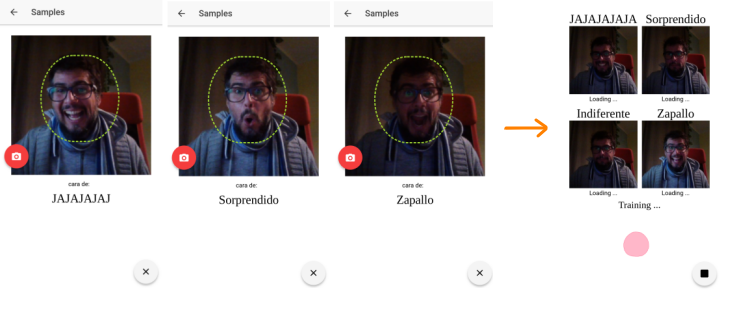
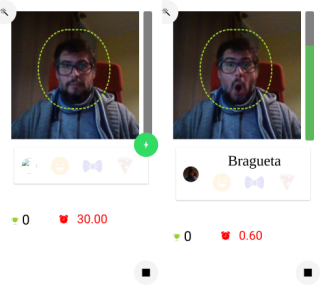
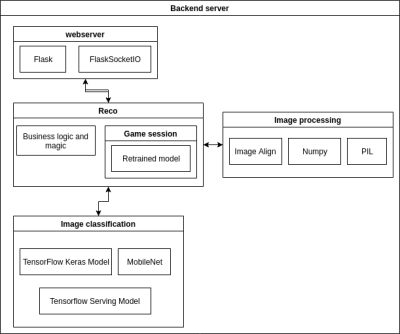

# Caripela
Mobile app , as a "videogame", for experimenting with Image Recognition/Machine Learning technologies.
The main idea of this game cames from [this](https://storage.googleapis.com/tfjs-examples/webcam-transfer-learning/dist/index.html)

A game where you can define 4 faces, train a
model to reconignice those faces, then play with that.

First, the images representing the categories is collected and trained the model with that.
In this screenshots, the categories are "surprise", "JAJAJJAJA", "zapallo". Then, the model is being trained to work with those faces-categories.

Once the player is ready to make the face, pressing the red button the app will start to take pictures during 3 seconds (20 pics approx).

When the training is finished, the game starts:

A match starts, during 30 seconds you have to replicate the same face you have been assigned to the category is randomly presented (Bragueta in the screenshot).
The vertical green bar indicate how close you are to the get the face replicated. If you reach the top, another category is displayed. The challengue is replicate as much faces as you can, during 30 seconds. Super silly, I know. 

## The project

The project is architectured in a client-server way. The server provide all the logic about image classification and the client is responsible for the image capturing and the "videogame" logic.

### Server

The backend exposses an API, through websockets, for interacting with the pre-trained MobileNet model.

This are the main events registered in the backend server:

const ADD_SAMPLE = 'backend_add_sample';
const TRAIN = 'backend_train';
const PREDICT = 'backend_predict';

The backend is in a separte repo. Coming soon!

### Client

The client is this project! It's an Ionic 2 project created through the ionic-cli and a very simple UI. It's a POC, so it's more like a quick-and-dirt approach.

The project has 3 main modules:
* Image capturing module: responsible for taking pictures from the camera/webcam
* Reco module: It's the client for accessing the Reco Server, it's more or less isolated with the rest of the app, so, it's not coupled to the game.
* Game module: it's a silly approach to a kind of game to make use of the image classification tech.

The **Reco** module handles the interaction with the Reco Server through websockets.
[Soket.IO](https://socket.io/) is the library used to send and receive events from the server. In the ImageProcessor, all the interaction with ws is wrapped into [rxjs.Observables](https://rxjs-dev.firebaseapp.com/) to make the integration with the rest of the Angular code more smoothly.

The **Game** module is a silly approach to a videogame, taking in consideration that this is a POC and an hybrid app, so, performance was some to keep in mind, but no a priority.
Even dough, the user experiece in mobile is pretty decent including animations and transitions.

## Conclusion

The flow overview is 
 1. capture images with the camera from a hybrid app
 1. convert then to base64
 1. stream them to a remote server through websock. 
 1. Classify those images with a model running with Tensorflow
 1. Return a response to the client
 
All in real time, without have been  compromised the user experience.
The server was deployed in a DigitalOcean droplet and worked like a charm and the app running in a low gama Android device.

